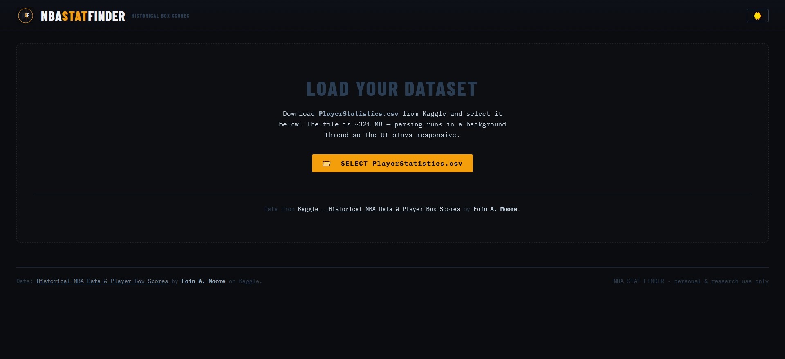
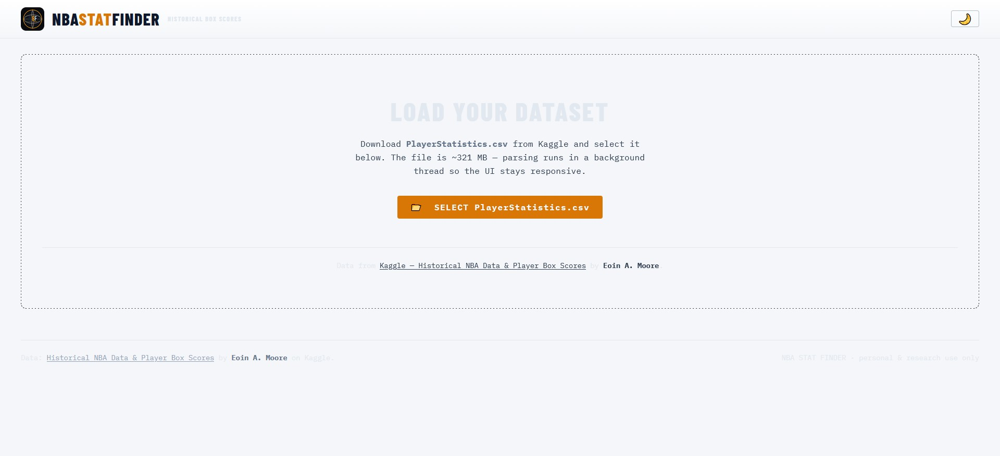

# NBA Stat Finder

<div align="center">
  
  <br /><br />
  <strong>Search every NBA player box score ever recorded.</strong>
  <br />
  Filter by stat thresholds, game type, player name, team — with per-column ≥ / ≤ / = modes.
  <br /><br />


</div>

---

## Overview

NBA Stat Finder is a fully client-side React app for exploring historical NBA player box scores. Load the dataset locally — nothing is uploaded to any server. All filtering, sorting, and rendering happens in your browser.

**Example queries you can answer:**

- _Has any player ever put up 30+ points, 10+ assists, and 10+ rebounds in a playoff game?_
- _Find every game where a player shot exactly 100% from the free throw line with at least 10 attempts_
- _Show all Kobe Bryant games with fewer than 3 turnovers and at least 40 points_

---

## Features

- **Per-column filter modes** — each stat column independently supports `≥ at least`, `≤ at most`, or `= exact`
- **Game type filter** — toggle between Regular Season, Playoffs, Pre-Season, Play-In, In-Season Tournament, and more
- **Full stat coverage** — PTS, AST, REB, DREB, OREB, BLK, STL, TO, PF, MIN, FGA, FGM, FG%, 3PA, 3PM, 3P%, FTA, FTM, FT%, +/-
- **Sortable columns** — click any column header to sort ascending or descending
- **Virtual scrolling** — renders 1.6M+ rows at 60fps via TanStack Virtual
- **Web Worker parsing** — 300MB CSV parsed in a background thread; UI stays fully responsive
- **Dark & light theme** — toggle with the ☀️ / 🌙 button in the header
- **Zero backend** — entirely client-side, no data leaves your machine

---

## Screenshots

> Dark mode · Light mode

| Dark                                              | Light                                               |
| ------------------------------------------------- | --------------------------------------------------- |
|  |  |

---

## Getting Started

### 1. Clone the repo

```bash
git clone https://github.com/mkaucic/nba-stat-finder.git
cd nba-stat-finder
```

### 2. Install dependencies

```bash
npm install
```

### 3. Download the dataset

This app requires **PlayerStatistics.csv** from Kaggle:

➡️ [Historical NBA Data and Player Box Scores](https://www.kaggle.com/datasets/eoinamoore/historical-nba-data-and-player-box-scores/data?select=PlayerStatistics.csv)

The file is ~321 MB. It is **not** included in this repository. You load it locally via the file picker in the app — it never leaves your browser.

### 4. Run the dev server

```bash
npm run dev
```

Open [http://localhost:5173](http://localhost:5173), click **SELECT PlayerStatistics.csv**, and select the file you downloaded. Parsing takes ~30–60 seconds on first load.

---

## Project Structure

```
nba-stat-finder/
├── public/
│   ├── favicon.ico
│   ├── logo-192.png
│   └── logo-512.png
└── src/
    ├── components/
    │   ├── FileLoader.tsx       # CSV file picker + attribution
    │   ├── GameTypeFilter.tsx   # Regular Season / Playoffs / etc. toggle
    │   ├── StatFilters.tsx      # Per-column ≥ ≤ = filter grid
    │   ├── ResultsTable.tsx     # Virtualised table (TanStack Virtual)
    │   └── Pagination.tsx       # Page nav controls
    ├── constants/
    │   └── columns.ts           # Column definitions + game type colours
    ├── types/
    │   └── stats.ts             # PlayerStatRow interface + filter types
    ├── utils/
    │   └── format.ts            # Value formatting + filter logic
    ├── workers/
    │   └── csvParser.worker.ts  # PapaParse running in a Web Worker
    ├── App.tsx
    ├── main.tsx
    └── index.css                # CSS variables (dark + light themes)
```

---

## Tech Stack

| Tool                                                                   | Purpose                               |
| ---------------------------------------------------------------------- | ------------------------------------- |
| [React 19](https://react.dev)                                          | UI framework                          |
| [TypeScript](https://www.typescriptlang.org)                           | Type safety                           |
| [Vite 7](https://vite.dev)                                             | Build tool & dev server               |
| [Tailwind CSS v4](https://tailwindcss.com)                             | Utility CSS (via `@tailwindcss/vite`) |
| [PapaParse](https://www.papaparse.com)                                 | CSV parsing in a Web Worker           |
| [TanStack Virtual](https://tanstack.com/virtual)                       | Virtual scrolling for large datasets  |
| [IBM Plex Mono](https://fonts.google.com/specimen/IBM+Plex+Mono)       | Body / monospace font                 |
| [Barlow Condensed](https://fonts.google.com/specimen/Barlow+Condensed) | Display / header font                 |

---

## Building for Production

```bash
npm run build
```

Output goes to `dist/`. Since the app is entirely static, you can host it on GitHub Pages, Netlify, Vercel, or any static host. Users will still need to load the CSV file themselves when they visit.

---

## Data Source

All data comes from the following Kaggle dataset, maintained by **Eoin A. Moore**:

> [Historical NBA Data and Player Box Scores](https://www.kaggle.com/datasets/eoinamoore/historical-nba-data-and-player-box-scores)

A huge thank you to Eoin for maintaining this comprehensive dataset. This project would not exist without it.

The dataset is **not redistributed** in this repository. Please download it directly from Kaggle and comply with its licence terms.

---

## Licence

MIT — see [LICENSE](LICENSE) for details.

This project is for **personal and research use only**. It is not affiliated with or endorsed by the NBA or any of its teams.
